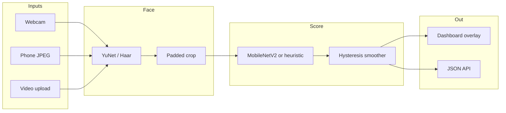

# Real-Time Deepfake Artifact Detector

**Face-swap spatial artifacts, scored live.** A Flask demo (webcam, phone frames, uploaded video) built with OpenCV, PyTorch, and a CNN classifier.

| | |
| --- | --- |
| **Problem** | Cheap face-swap pipelines leave blend seams, over-smoothed texture, color mismatch, and extra compression around the face. Reviewers still need a **scoped** tool that can flag those cues in real time—not a claim that “all deepfakes” are solved. |
| **What it does** | Finds a face (YuNet, Haar fallback), scores **face-swap style artifacts** with MobileNetV2 or an explicit heuristic, and smooths labels with hysteresis so the overlay does not flicker. |
| **Who it's for** | Recruiters and engineers who want a runnable API/demo; professors and TAs who want a method + eval protocol + limits writeup (`docs/TECH_REPORT.md`). |
| **Author** | Magne Dina Neves ([KRYPTON0078](https://github.com/KRYPTON0078)), University of Macau |

> **Scope disclaimer:** This project detects spatial/blending artifacts common in classic face-swap pipelines. It does **not** claim general detection of all modern generative video models.

**Keywords:** `deepfake-detection` · `face-swap` · `media-forensics` · `computer-vision` · `pytorch` · `opencv` · `mobilenetv2` · `yunet` · `flask` · `trustworthy-ai`

---

## One-command demo

Heuristic mode runs **without training**. That is the shortest path:

```bash
git clone https://github.com/KRYPTON0078/realtime-deepfake-artifact-detector.git
cd realtime-deepfake-artifact-detector
./scripts/demo_up.sh
```

Open [http://127.0.0.1:5000](http://127.0.0.1:5000). Smoke-check only: `./scripts/demo_up.sh --smoke` (prints `GET /health`, then exits).

Windows:

```bat
scripts\demo_up.bat
```

Already have deps? `./run.sh` or `run.bat` just starts Flask (uses `.venv` when present).

`GET /health` reports `mode` (`heuristic` until you train a checkpoint), face-detector backend, and thresholds. Webcam is optional: upload a short clip if you have no camera.

Optional CNN (synthetic plumbing data, **not** a real benchmark):

```bash
python scripts/generate_demo_dataset.py
python training/train.py
# restart the app — GET /health should show "mode": "cnn"
```

Talk track for a live walkthrough: [`docs/DEMO_SCRIPT.md`](docs/DEMO_SCRIPT.md). Demo recording placeholder: [`docs/DEMO.md`](docs/DEMO.md).

---

## Architecture



Details: [`docs/TECH_REPORT.md`](docs/TECH_REPORT.md) · limitations: [`docs/LIMITATIONS.md`](docs/LIMITATIONS.md).

---

## Results

**No FaceForensics++ or Celeb-DF metrics are checked into this repository.** Do not invent or quote in-domain accuracy from this README.

What *is* on disk:

| Source | n | Acc / F1 / AUC | What it means |
| --- | --- | --- | --- |
| `models/calibrated_thresholds.json` | 24 synthetic images (12/12) | **1.0 / 1.0 / 1.0** (ECE ≈ 0.0018) | **Demo/synthetic plumbing only.** Cartoon ellipse “faces” from `scripts/generate_demo_dataset.py`. Perfect scores are expected and are **not** real-world deepfake performance. |
| `models/eval_metrics.json` | — | not committed | Produced by `python training/evaluate.py` after you train on licensed crops. |
| `models/video_eval_metrics.json` | — | not committed | Produced by `python scripts/eval_videos.py` once `data/eval_clips/` has videos. |
| Unit tests | constructed 4-point example | 1.0 by design | Tests the metric helpers, not the detector. |

Default clone: **no** `artifact_detector.pt` → live demo runs in **heuristic** mode. Protocol for a real split (FF++ c23 Deepfakes + FaceSwap, Celeb-DF holdout, video-level top-k mean) is documented in the tech report; run it before putting numbers on a poster.

---

## Demo video

A 2–3 minute recording is **not attached yet**. Magne: drop an mp4 or URL using [`docs/DEMO.md`](docs/DEMO.md), then replace this paragraph with the link (GitHub Release asset preferred).

Until then, run the one-command demo above or follow [`docs/DEMO_SCRIPT.md`](docs/DEMO_SCRIPT.md).

---

## Features

- Real-time webcam overlay (YuNet box, label, confidence)
- Device-camera frames for Android WebView / mobile browsers (`POST /analyze/frame`)
- Async uploaded-video jobs with pruning-safe queue APIs
- MobileNetV2 classifier with heuristic fallback
- Hysteresis temporal smoothing and calibrated thresholds
- Eval helpers: precision / recall / F1 / AUC / ECE and video-level aggregation
- Android WebView wrapper with LAN cleartext support

---

## API

| Method | Path | Role |
| --- | --- | --- |
| `GET` | `/` | Dashboard |
| `GET` | `/about` | Limitations page |
| `GET` | `/health` | Mode, checkpoint flag, camera, worker, thresholds |
| `GET` | `/video_feed` | MJPEG overlay (background worker) |
| `GET` | `/api/score` | Latest JSON score |
| `GET`/`POST` | `/api/config` | Stride + thresholds |
| `POST` | `/camera/start` `/camera/stop` | Host webcam |
| `POST` | `/analyze/frame` | Base64 JPEG (mobile) |
| `POST` | `/analyze/upload` | Queue video job |
| `GET` | `/analyze/upload/<job_id>` | Job status |
| `GET` | `/analyze/upload/jobs` | List jobs |
| `DELETE` | `/analyze/upload/<job_id>` | Drop job metadata |

Bind on all interfaces for a phone on LAN: `APP_HOST=0.0.0.0 APP_PORT=5000 python app/server.py`.

---

## Research-grade data

Synthetic data is for wiring checks only. For a paper-shaped run, place **licensed** FF++ / Celeb-DF videos under `data/raw_videos/{real,fake_face_swap}/`:

```bash
python scripts/download_sample_data.py --run-crop
python training/train.py
python training/evaluate.py
python scripts/calibrate_thresholds.py
python scripts/eval_videos.py
```

Document subset, split seed, compression (prefer FF++ **c23**), and crop settings before reporting. See [`data/README.md`](data/README.md).

---

## Android

[`docs/ANDROID.md`](docs/ANDROID.md). Emulator URL: `http://10.0.2.2:5000/`. Phone:

```bash
./gradlew assembleDebug -PBACKEND_URL=http://<LAN-IP>:5000/
```

---

## Tests

```bash
pytest tests/ -q
```

Covers preprocess tensors, hysteresis labels, metric helpers, checkpoint mode smoke, and `GET /health`.

---

## Docs

| Doc | Contents |
| --- | --- |
| [`docs/TECH_REPORT.md`](docs/TECH_REPORT.md) | Method, pipeline, eval protocol, limits (citation-ready) |
| [`docs/LIMITATIONS.md`](docs/LIMITATIONS.md) | Attack class, ethics |
| [`docs/DEMO.md`](docs/DEMO.md) | Where to drop the 2–3 min video |
| [`docs/DEMO_SCRIPT.md`](docs/DEMO_SCRIPT.md) | Spoken 2-minute demo |
| [`docs/RELEASE_v0.1.0.md`](docs/RELEASE_v0.1.0.md) | GitHub Release body + publish checklist |
| [`CHANGELOG.md`](CHANGELOG.md) | v0.1.0 notes |
| [`CITATION.cff`](CITATION.cff) | GitHub citation file |

---

## Author / citation

**Magne Dina Neves** ([KRYPTON0078](https://github.com/KRYPTON0078))  
University of Macau

```bibtex
@software{neves2026deepfakeartifact,
  author    = {Neves, Magne Dina},
  title     = {Real-Time Deepfake Artifact Detector},
  year      = {2026},
  version   = {0.1.0},
  publisher = {University of Macau},
  url       = {https://github.com/KRYPTON0078/realtime-deepfake-artifact-detector},
  license   = {MIT}
}
```

Issues and PRs welcome. Please keep README/CV claims aligned with [`docs/LIMITATIONS.md`](docs/LIMITATIONS.md).

## License

[MIT](LICENSE) © 2026 Magne Dina Neves
