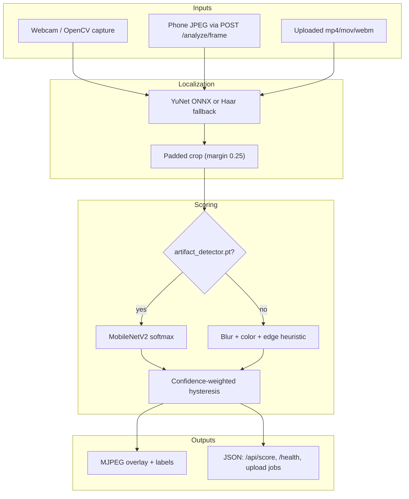

# Real-Time Detection of Face-Swap Spatial Artifacts

**A scoped media-forensics demo with YuNet localization and MobileNetV2 scoring**

| | |
| --- | --- |
| **Author** | Magne Dina Neves ([KRYPTON0078](https://github.com/KRYPTON0078)) |
| **Affiliation** | University of Macau |
| **Software** | https://github.com/KRYPTON0078/realtime-deepfake-artifact-detector |
| **Version** | 0.1.0 (2026-09-08) |
| **License** | MIT |

**How to cite.** See `CITATION.cff` in the repository root, or:

> Neves, M. D. (2026). *Real-Time Detection of Face-Swap Spatial Artifacts* (Version 0.1.0) [Computer software]. University of Macau. https://github.com/KRYPTON0078/realtime-deepfake-artifact-detector

---

## Abstract

Cheap face-swap tools leave a recognizable family of **spatial artifacts**: blend seams around the jaw, over-smoothed skin texture, color mismatch against the neck and hair, and extra compression after re-encoding. This project is a **research and recruiting demo** that scores those cues on webcam frames, phone-camera JPEGs, and uploaded clips. Faces are localized with OpenCV YuNet (Haar cascade fallback), cropped with a shared margin policy, and scored either by a MobileNetV2 classifier or by an explicit heuristic when no checkpoint is present. Frame scores are temporally smoothed with hysteresis so the live overlay does not flicker.

The attack class is deliberately narrow. The system does **not** claim detection of diffusion video, neural rendering, audio deepfakes, or “any fake face.” No FaceForensics++ or Celeb-DF numbers are checked into this repository. The only numerical report on disk is a **synthetic plumbing check** (`n = 24` cartoon face crops) that saturates accuracy and must not be quoted as real-world performance.

**Keywords:** deepfake detection, face-swap artifacts, media forensics, YuNet, MobileNetV2, temporal hysteresis, trustworthy AI.

---

## 1. Motivation

Recruiters and course reviewers need a project they can **run in one command**, inspect as code, and discuss as a method—not a slogan. Industry readers care about a live API and an honest scope line. Academic readers care about the detector family, the evaluation protocol, and what is still missing.

Classic face-swap pipelines (graphics blending, autoencoder identity transfer, early GAN face-swap) still circulate in messaging apps and low-budget media. They often fail at the **face–head boundary** and in **high-frequency texture**. A detector that only looks for those failures is easier to explain, easier to demo, and harder to overclaim than a “universal deepfake” product.

This writeup therefore treats the codebase as a **scoped artifact detector**: useful for teaching, portfolio review, and as a starting point for licensed-dataset experiments—not as a forensic oracle.

---

## 2. Problem statement

**Input.** An RGB frame (webcam, resized phone JPEG) or a sampled video.

**Output.** For each analyzed frame: whether a face was found, a box, a fake-class probability in \([0, 1]\), and a discrete label (`likely_real`, `suspicious`, `likely_manipulated`, or `no_face`). Uploaded videos also return an average probability and the fraction of sampled frames labeled manipulated.

**Positive class.** Face-swap style spatial manipulation (blend / texture / color / compression artifacts), not “any synthetic media.”

**Non-goals.** Diffusion and high-quality neural renderers; full-body or audio-only fakes; courtroom evidence; an enterprise content-moderation platform.

---

## 3. Method

### 3.1 Face localization and crop policy

Inference uses OpenCV `FaceDetectorYN` with the bundled ONNX weights `models/face_detection_yunet_2023mar.onnx` when the file and API exist. Score threshold, NMS, and a minimum confidence of 0.55 filter weak boxes; the largest remaining box is kept. If YuNet yields nothing, a frontal Haar cascade is used.

The same crop helper is shared by training-data prep and live inference (`detector/face_crop.py`): expand the box by **25% margin**, clamp to the frame, reject crops smaller than 64 px on a side. Sharing this policy avoids a silent train/serve mismatch where the CNN sees tightly cropped faces at train time and padded faces at test time.

### 3.2 Scoring heads

**CNN path (mode `cnn`).** If `models/artifact_detector.pt` exists, ImageNet-pretrained **MobileNetV2** is loaded with a 2-way linear head (`real` vs `fake_face_swap`). The face crop is converted BGR→RGB, resized to 224×224, and normalized with ImageNet mean/std **without PIL** on the hot path (`detector/preprocess.py`). Softmax probability of the fake class is the raw score. An optional smaller `custom_cnn` architecture exists for ablation but is not the default.

**Heuristic path (mode `heuristic`).** If no checkpoint is present—the default for a fresh clone—the score is a convex combination of three spatial cues on the face crop (`detector/inference.py`):

| Cue | Signal | Weight |
| --- | --- | --- |
| Blur / texture loss | \(1 - \min(\mathrm{Var}(\nabla^2 I) / 500, 1)\) on grayscale | 0.45 |
| Color inconsistency | saturation-channel std (HSV), scaled | 0.30 |
| Boundary energy | Canny edge density, scaled | 0.25 |

This is an **interpretable fallback for demos**, not a substitute for a model trained on licensed swaps. It will fire on motion blur, heavy beauty filters, and poor lighting.

### 3.3 Temporal smoothing and operating points

Live webcam and phone streams use a window-8 smoother with optional **detection-confidence weights** and **hysteresis** (`detector/temporal.py`):

- enter fake when the smoothed score \(\ge\) `enter_fake` (default 0.55 from the checked-in calibration file)
- stay fake until the score \(\le\) `exit_fake` (default 0.35)
- `warn_threshold` (default 0.35) yields `suspicious` without latching

Unsmoothed scores are used for uploaded-video sampling so each sampled frame is comparable. Runtime `POST /api/config` can change stride and thresholds without retraining.

Default constants in code (`fake_threshold=0.55`, `warn=0.40`, `enter=0.60`, `exit=0.45`) are overridden when `models/calibrated_thresholds.json` is present.

### 3.4 Training recipe (optional CNN)

`training/config.yaml` fine-tunes MobileNetV2 for up to 20 epochs, Adam, head LR \(3\times10^{-4}\), backbone LR \(3\times10^{-5}\), one epoch of backbone freeze, early stopping on validation F1 (patience 5), seed 42. Class imbalance is handled with a weighted sampler. Train-time augmentation includes flip, color jitter, Gaussian blur, JPEG recompression, noise, and mild scale jitter—deliberately overlapping the artifact family we hope to detect, which is a **leakage risk** if reported as generalization to unseen generators.

The checkpoint stores `val_f1`, the F1-maximizing threshold, and a warn threshold 0.15 below it. `scripts/calibrate_thresholds.py` rewrites the JSON operating points from a validation sweep.

---

## 4. System pipeline

The Flask app (`app/server.py`, `app/routes.py`, `app/state.py`) isolates smoother state for webcam, mobile, and upload paths so one stream does not contaminate another. Webcam inference is strided (default every 2nd frame) and a background worker encodes the latest overlay JPEG. Mobile requests are bounded by a semaphore and longest-side resize (default 640 px). Upload jobs run on a small thread pool, prune finished metadata, and delete the temp file after analysis.

An Android WebView wrapper (`android/`) loads the same UI and posts device frames to `/analyze/frame`. It is a LAN demo shell, not a separate on-device model.

---

## 5. Evaluation protocol

Report results only when the following are fixed and written down (see also `docs/LIMITATIONS.md` and `data/README.md`):

1. **Dataset and license.** FaceForensics++ Deepfakes + FaceSwap at **c23** compression is the intended in-domain set; Celeb-DF v2 is the intended **cross-dataset holdout**, not a training mix-in unless explicitly ablated.
2. **Split.** Video-level split before cropping. Default crop script uses `val_ratio=0.2`, `seed=42`. Never split after dumping all frames into one folder.
3. **Crop.** Same YuNet + 0.25 margin as inference (`scripts/crop_faces_from_videos.py`).
4. **Image-level metrics.** `training/evaluate.py` writes precision, recall, F1, accuracy, ROC-AUC, confusion counts, and expected calibration error (10 bins) at threshold 0.55 and at the F1-maximizing threshold (`training/metrics.py`).
5. **Video-level metrics.** `scripts/eval_videos.py` scores held-out clips under `data/eval_clips/{real,fake_face_swap}/`, aggregates per-video **top-k mean** of face-bearing frame scores (default \(k=5\)), then computes the same binary metrics.
6. **What not to report.** Accuracy on `scripts/generate_demo_dataset.py` output. Those images are ellipses with optional blur and a rectangle—perfect separation is expected and scientifically empty.

Until licensed videos are trained and the JSON reports are committed, **there is no public in-domain or cross-dataset number for this project.**

---

## 6. Results (what exists in the repo)

### 6.1 Synthetic demo calibration — not a benchmark

`models/calibrated_thresholds.json` is checked in. It records a threshold sweep on a **synthetic** validation set:

| Field | Value | Interpretation |
| --- | --- | --- |
| Support | 24 images (12 fake / 12 real by confusion counts) | Tiny cartoon crops from the demo generator |
| Accuracy / precision / recall / F1 / AUC | 1.0 at thresholds 0.50 and 0.55 | Classes are trivially separable |
| ECE | \(\approx 0.0018\) | Softmax is peaked because the task is toy |
| Chosen operating points | `fake=0.50`, `warn=0.35`, `enter=0.55`, `exit=0.35` | Useful only until you recalibrate on real val data |

**Do not cite these figures in a paper, poster, or CV bullet as deepfake detection performance.** `docs/LIMITATIONS.md` already states that a perfect synthetic val accuracy is not evidence of real-world quality.

### 6.2 Research datasets — not run in this tree

| Protocol | Status in v0.1.0 |
| --- | --- |
| FF++ c23 Deepfakes + FaceSwap, image-level | Scripted (`training/evaluate.py`); **no `models/eval_metrics.json` committed** |
| Video-level top-k mean | Scripted (`scripts/eval_videos.py`); **`data/eval_clips/` has no videos** |
| Celeb-DF v2 cross-dataset | Documented as holdout; **not executed here** |
| CNN checkpoint | **Not shipped** (`*.pt` gitignored). Fresh clone → `mode=heuristic` |

Quality gates in `tests/test_quality_gates.py` assert shapes, hysteresis latching, and that metric helpers return 1.0 on a **hand-constructed** four-point separable example. That tests the metric code, not the detector.

### 6.3 Runtime observability

`GET /health` reports `ok`, `mode`, `checkpoint_present`, `face_detector_backend`, camera/worker flags, and thresholds. That is the intended demo “are we in heuristic or cnn?” signal—not an accuracy claim.

---

## 7. Limitations

- **Attack-class mismatch.** Diffusion video and high-quality neural rendering often lack the blend seams this method looks for. Expect silent misses.
- **Heuristic false positives.** Blur, filters, and low light raise the fallback score on real faces.
- **Face detector dependence.** No face ⇒ score 0 and label `no_face`. Profile views and occlusion drop recall.
- **Temporal delay.** Hysteresis reduces flicker and adds lag when the subject’s status changes.
- **Augmentation overlap.** JPEG and blur augmentation can teach the CNN the demo heuristic rather than identity-swap geometry.
- **No calibrated real-world ECE.** Synthetic ECE is not transferable.
- **Ethical.** Probabilities are not legal proof. High-stakes use needs a human reviewer. Do not scan people without a lawful, consensual context.

---

## 8. Future work

Priority is **honest numbers on licensed data**, not productization:

1. Train on FF++ c23 Deepfakes + FaceSwap with a video-level split; commit `eval_metrics.json` and the exact subset list.
2. Hold out Celeb-DF v2 clips for video-level top-k mean; report the drop, including if it is severe.
3. Recalibrate thresholds on real validation scores; replace the synthetic JSON.
4. Compare MobileNetV2 vs `custom_cnn` vs a frozen-backbone linear probe.
5. Add a simple temporal CNN or longer smoother only after frame-level in-domain metrics exist.
6. Record a 2–3 minute demo (`docs/DEMO.md`) using only licensed or self-captured media.

Out of scope unless the research question changes: “detect all GenAI video,” streaming SaaS, and identity tracking.

---

## 9. Reproducibility

| Item | Location |
| --- | --- |
| One-command demo | `scripts/demo_up.sh` |
| Python deps | `requirements.txt` |
| Train config | `training/config.yaml` (seed 42) |
| Synthetic data | `scripts/generate_demo_dataset.py` |
| Licensed data layout | `scripts/download_sample_data.py`, `data/README.md` |
| Tests | `pytest tests/ -q` |
| Limitations | `docs/LIMITATIONS.md` |

Python 3.10+, CPU is enough for the heuristic demo. CNN training prefers a GPU but is optional.

---

## 10. Conclusion

This repository is a **narrow, runnable artifact detector** for classic face-swap cues, packaged so a recruiter can start a dashboard and a professor can read the method, the protocol, and the gaps. The interesting claim is the scope line—not a leaderboard number. The next scientific step is a documented FF++ / Celeb-DF run; until that JSON exists, the only honest metric sentence is: *synthetic plumbing saturates; real benchmarks are not reported.*
